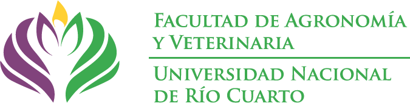
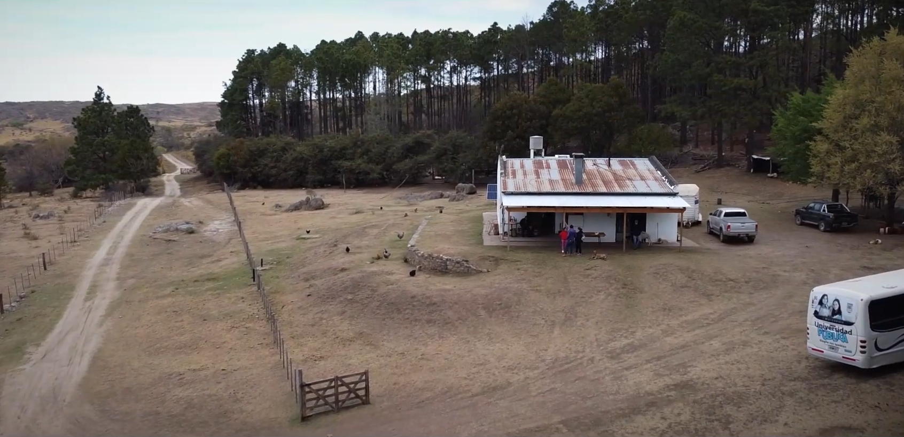
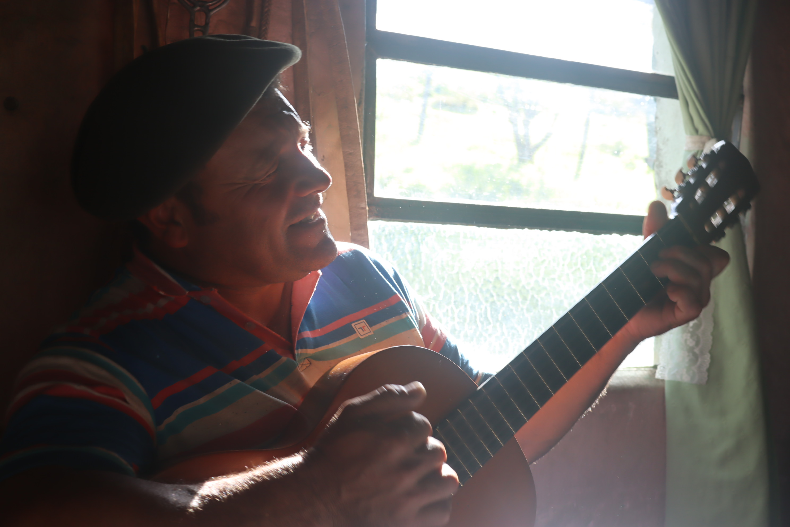
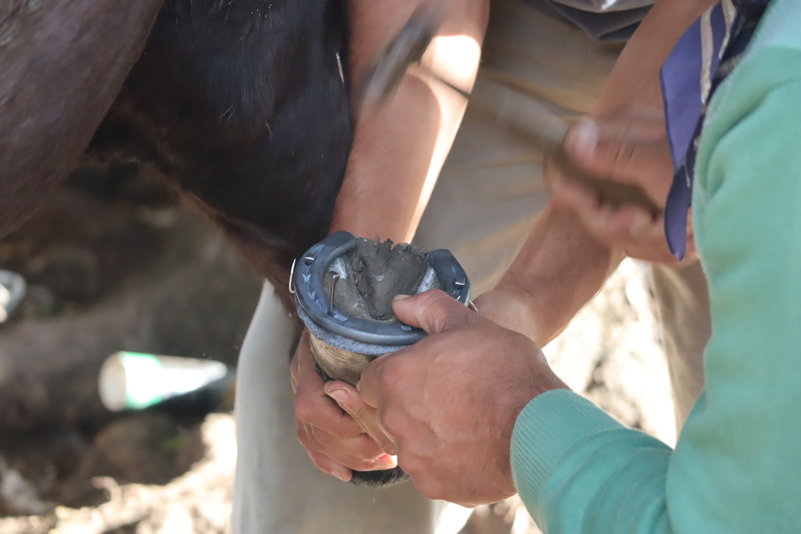
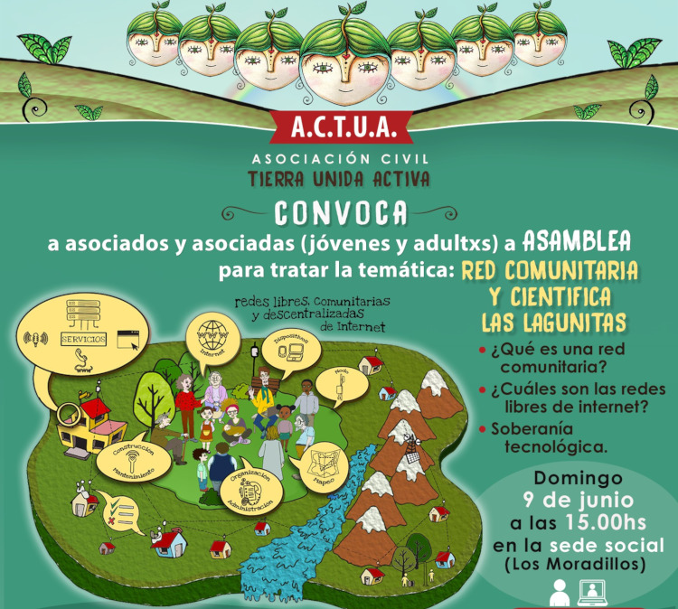
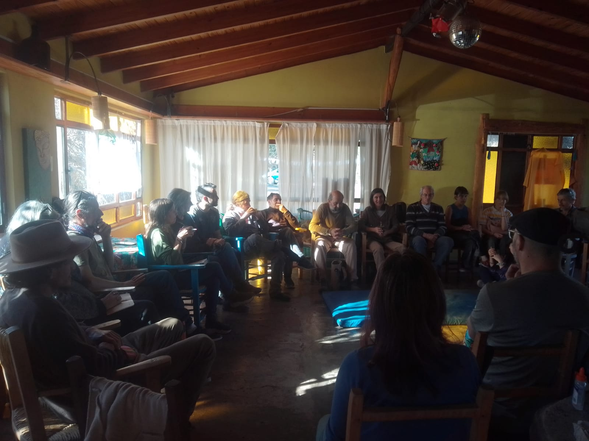
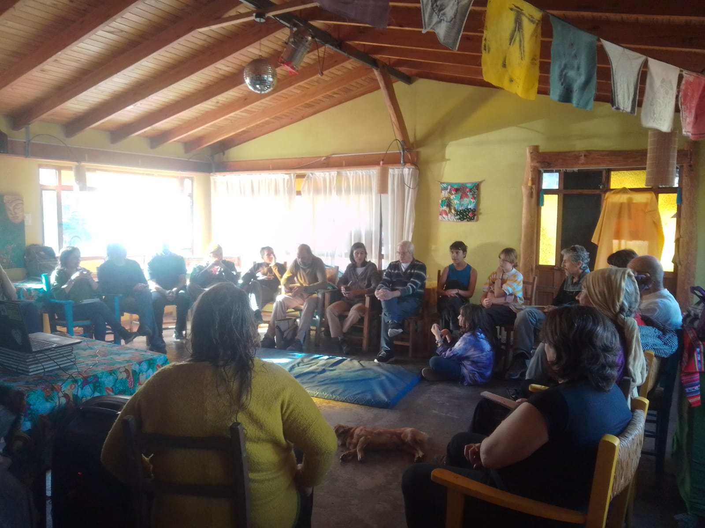
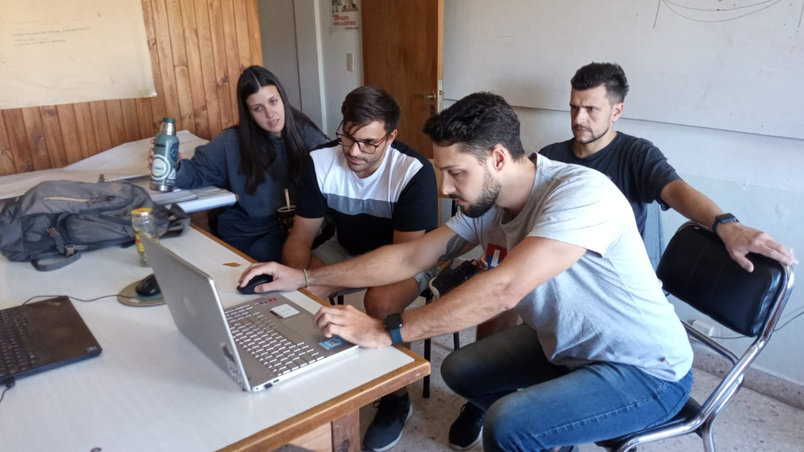

# 

Desintoxicar la utopía digital: la experiencia de la red comunitaria y científica de internet rural en Las Lagunitas. <b>Construcción Social desde el Territorio</b> by Daniel Bellomo bajo licencia <a href="https://creativecommons.org/licenses/by-sa/4.0/deed.es" target="_blank" rel="license noopener noreferrer" style="display:inline-block;">CC BY-SA 4.0</a>

 

# Las Lagunitas Red Comunitaria y Científica de Internet Rural

Construcción Social desde el Territorio

**Visión holística**

# Inspiración

- Oso Grosclaude - UNCOMA  
- Carlos Frank - RETINA  
- Nico Echániz - AlterMundi  
- Ramon Roca - guifi-net

# Ruralidad

- Campo Las Guindas (UNRC)
- Paraje Las Lagunitas
- La región: Cerro Colorado, Lutti, ...

https://t.ly/0qFQg

# Conectividad desde los territorios

by **AlterMundi**

https://t.ly/sbP8R

# Espiral virtuoso

1. Las Guindas
1. familias del paraje
1. escuela rural
1. bomberos
1. ACTUA
1. CADEL
1. más familias
1. más instituciones
1. ...

# Las Guindas

~~La semilla~~ el carozo del proyecto

# La Comunidad

# 

# 

# Vínculo con las flias

- Guillermo Balboa (FAV)
- Nano D'eramo (Geología)

# 

# 

# Familias del paraje 

Walter, Fabian, Joaquin, Neolia, Martina, Franco, Martin, Luciana, Gladys, Gonzalo, Patricio, Ale, Domingo, Eulalia, Julio, Maricel, Diego, Kika ...

(videos) 

# 

# 

# 

# 

# 

# 

# Otras instituciones del territorio

- Escuela rural
- Asociación Civil Tierra Unida Activa (ACTUA)
- Coop Electricidad, internet y tel Alpa Corral 
- Bomberos Voluntarios
- UNRC
- Coop electricidad de RDLS
- Coop gestion.ar
- Radioaficionados
- Municipalidad 

# Escuela rural

# 

# 

# 

# ACTUA

- Titular de la licencia ["Valor Agregado Red Comunitaria" (VARC)](https://altermundi.net/como-solicitar-una-licencia-varc-de-redes-comunitarias/)
- Trabajo territorial
- Coordinación del proyecto y gestión de recursos

# 

# 

# 

# 

# CADEL

- Proveedor de acceso a Internet
- infraestructura compartida

# Bomberos voluntarios

- detección temprana de incendios
- mapeo

# 

# 

# UNRC

- la "pata" científica de la red
- prácticas en el territorio
  - sociocomunitarias, profesionales, TP, tesis ...
  - computación, telecomunicaciones, energía solar, agronomía, meteorología, filosofía ...
- Instituto de Ciencias de la Tierra, Biodiversidad y Ambiente [(ICBIA)](https://icbia.conicet.gov.ar)
- Cátedra Libre de Soberanía Tecnológica [(CLiSTec)](https://clistec.libre.org.ar)
  - en formación ...

# 

# 

# Radioaficionados

# 

# 

Red de Alta Velocidad de Radioaficionados Argentinos para emergencias (RAVRAe)

# Gobernanza

Gobernanza de los bienes comunes. Elinor Ostrom “El gobierno de los bienes comunes”, 8 principios que permiten a las comunidades gestionar de manera sostenible los bienes comunes

[La Gobernanza de las Redes Comunitarias de Internet (guifi-net)](https://landing.guifi.net/es/la-gobernanza-de-las-redes-comunitarias-de-internet/)

# Vinculaciones con otras Universidades

- Univ. Nac. de los Comechingones (Ali)
- UBA antropología (Augusto)
- Instituto Balseiro (Laila)
- Univ. Politécnica de Valencia (Pietro)
- UBA Ing (Ignacio)
- HOT Hub LAC (Tim, Juan, Emi)
- ...

# ¡Muchas Gracias!

