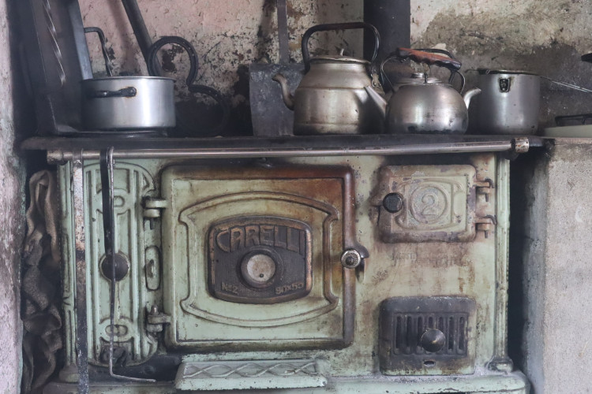

# 

# 

Desintoxicar la utopía digital: la experiencia de la red comunitaria de internet rural en Las Lagunitas. El Proyecto. by daniel bellomo bajo licencia<a href="https://creativecommons.org/licenses/by-sa/4.0/deed.es" target="_blank" rel="license noopener noreferrer" style="display:inline-block;">CC BY-SA 4.0</a>

# Las Lagunitas Red Comunitaria y Científica de Internet Rural

Visión holística

# inspiración

- Oso Grosclaude - UNCOMA  
- Carlos Frank - RETINA  
- Nico Echániz - AlterMundi  
- Ramon Roca - Guifi-net

# Ruralidad

- Campo Las Guindas UNRC
- Paraje Las Lagunitas
- La región: Cerro Colorado, Lutti 

https://t.ly/0qFQg

# Conectividad desde los territorios

https://t.ly/sbP8R

# Espiral

1. Las Guindas
2. familias del paraje
3. instituciones 
4. ...

# La Comunidad

#

# 

# Vínculo con las flias

- Guillermo Balboa (FAV)
- Nano D'eramo (Geología)

#

#

# Familias del paraje 

Walter, Fabian, Joaquin, Neolia, Martina, Franco, Martin, Luciana, Gladys, Gonzalo, Patricio, Ale, Domingo, Eulalia, Julio, Maricel, Diego, Kika ...

(videos)

#

# 

#

#

# Otras instituciones del territorio

- Escuela rural
- Asociación Civil Tierra Unida Activa (ACTUA)
- Coop Electricidad, internet y tel Alpa Corral 
- Bomberos Voluntarios
- UNRC
- Coop electricidad de RDLS
- Coop gestion.ar
- Radioaficionados
- Municipalidad

# Escuela rural

#

# 

#

# ACTUA

- Titular de la licencia ["Valor Agregado Red Comunitaria" VARC](https://altermundi.net/como-solicitar-una-licencia-varc-de-redes-comunitarias/)
- Trabajo territorial
- Coordinación del proyecto y gestión de recursos

#

# CADEL

- Proveedor de acceso a Internet
- infraestructura compartida

# Bomberos voluntarios

- detección temprana de incendios
- mapeo

# 

#

# UNRC

- la "pata" científica de la red
- prácticas en el territorio
  - sociocomunitarias, profesionales, TP, tesis ...
  - computación, telecomunicaciones, energía solar, agronomía, meteorología, filosofía ...
- Instituto de Ciencias de la Tierra, Biodiversidad y Ambiente
- Cátedra Libre de Soberanía Tecnológica (CLiSTec)
  - en formación ...

# Radioaficionados

# 

# 

Red de Alta Velocidad de Radioaficionados Argentinos para emergencias (RAVRAe)

# Gobernanza

Gobernanza de los bienes comunes. Elinor Ostrom “El gobierno de los bienes comunes”, 8 principios que permiten a las comunidades gestionar de manera sostenible los bienes comunes

[La Gobernanza de las Redes Comunitarias de Internet](https://landing.guifi.net/es/la-gobernanza-de-las-redes-comunitarias-de-internet/)

# Vinculaciones con otras Universidades

- Univ. Nac. de los Comechingones (Ali)
- UBA (Augusto)
- Instituto Balseiro (Laila)
- Univ. Politécnica de Valencia (Pietro)
- HOT Hub LAC

# ¡Muchas Gracias!
